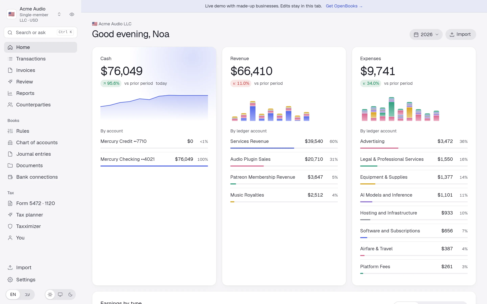
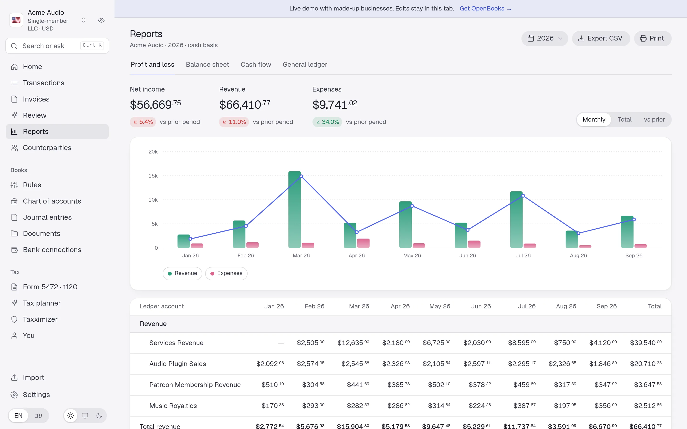
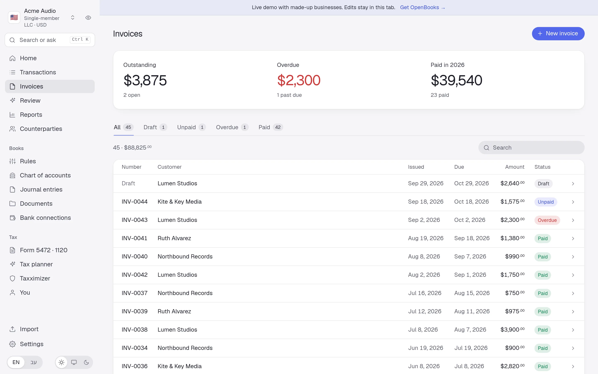
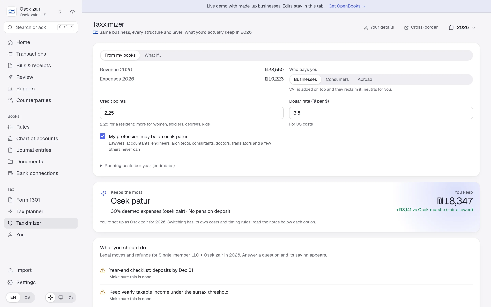
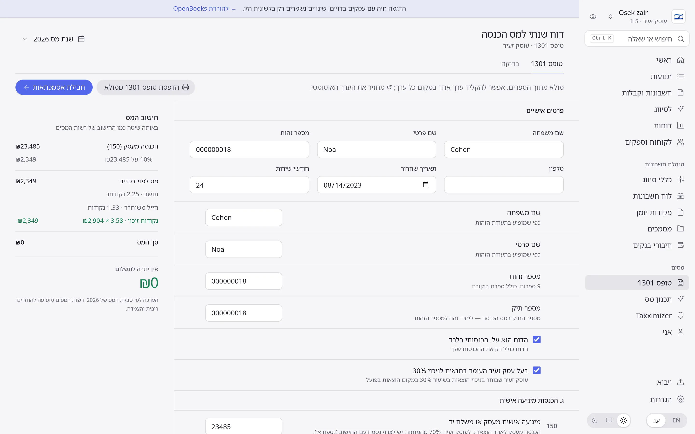

<div align="center">

# OpenBooks

**Bookkeeping and tax that live on your computer.**<br>
Bank sync, invoices, reports and tax forms for freelancers, Israeli osek and US LLCs. No account, no cloud, no subscription.

[**Live demo →**](https://derpcatmusic.github.io/openbooks/demo/) · [Website](https://derpcatmusic.github.io/openbooks/) · [Download](https://github.com/DerpcatMusic/openbooks/releases/latest)

<picture>
  <source media="(prefers-color-scheme: dark)" srcset="site/img/home-dark.webp">
  
</picture>

</div>

<!-- derpcat-support -->
<p align="center">
  <a href="https://www.patreon.com/derpcatmusic">
    
  </a>
</p>
<!-- /derpcat-support -->

## Why OpenBooks

|  |  |
|---|---|
| **Bank sync** | Mercury API, Israeli banks and cards (Hapoalim, Leumi, Discount, Max, Cal, One Zero…), bit, any bank's CSV |
| **Rules & review** | Classify once and it sticks. A keyboard-first queue clears the rest |
| **Reports** | P&L, balance sheet, cash flow, general ledger. Monthly, total or vs last year |
| **Invoices** | US invoices, Israeli חשבון עסקה / קבלה / חשבונית מס, matched to payments |
| **Tax** | 🇮🇱 Form 1301 over the official form, proof pack, osek zair planner · 🇺🇸 Form 5472 + pro forma 1120 |
| **⌘K + AI** | Jump anywhere, run actions, ask your books with your own key or a local model |
| **MCP** | Claude and other MCP clients read your books and propose changes you approve |
| **Private** | One SQLite file. Secrets sealed with AES-256-GCM. Listens on 127.0.0.1 only |

English and Hebrew (RTL), light and dark, and a privacy mode that scrambles every number for screen-shares. Israeli bank sync needs Chrome or Chromium installed.

## Quick start

```bash
./openbooks              # download from Releases → http://127.0.0.1:8765
```

From source, with [Bun](https://bun.sh):

```bash
bun install && (cd apps/web && bunx vp build)
bun apps/server/src/main.ts
OPENBOOKS_HOME=examples/showcase bun apps/server/src/main.ts   # with the demo's sample books
```

| Env | Default | |
|---|---|---|
| `OPENBOOKS_HOME` | `./entities` | `books.db` plus each business's statements and documents |
| `OPENBOOKS_PORT` | `8765` | Local port (127.0.0.1 only) |

## Screens

<table>
<tr>
<td><picture><source media="(prefers-color-scheme: dark)" srcset="site/img/reports-dark.webp"></picture></td>
<td><picture><source media="(prefers-color-scheme: dark)" srcset="site/img/invoices-dark.webp"></picture></td>
</tr>
<tr>
<td><picture><source media="(prefers-color-scheme: dark)" srcset="site/img/taxximizer-dark.webp"></picture></td>
<td><picture><source media="(prefers-color-scheme: dark)" srcset="site/img/tax-il-dark.webp"></picture></td>
</tr>
</table>

## Use it from Claude

```bash
claude mcp add openbooks -- /path/to/openbooks mcp
```

Reads run on their own; anything that changes the books waits for your approval. Details in [docs/mcp.md](docs/mcp.md).

## Develop

```bash
bun install
bun run test && bun run check && bun run typecheck
bun apps/server/build.ts          # single binary → dist/
bun scripts/demo/build.ts         # website + demo → _site/
```

Bun · SvelteKit · Tailwind 4 · Effect · SQLite. Architecture: [docs/architecture.md](docs/architecture.md).
Country packs live in `packages/countries/*`. Other countries' tax tables, bank formats and translations are welcome.

---

<sub>OpenBooks is a tool, not tax advice. Have a professional review anything you file. [AGPL-3.0](LICENSE).</sub>
